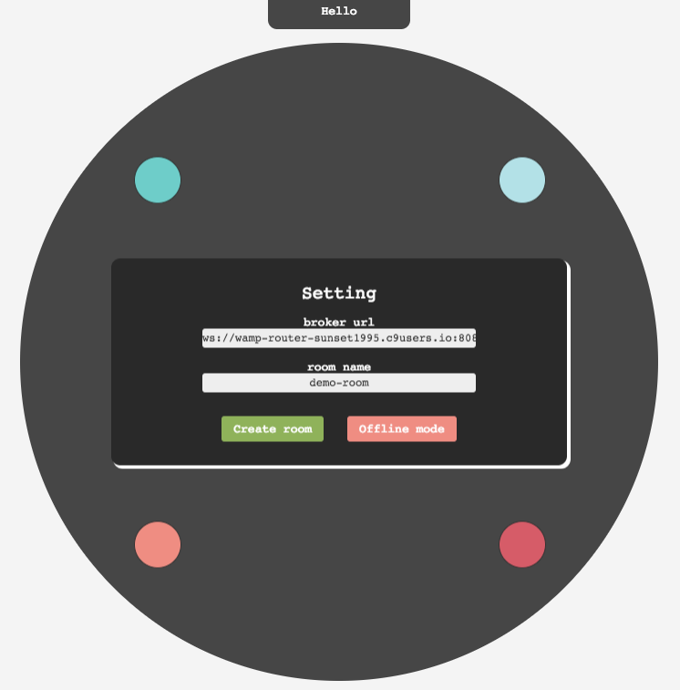
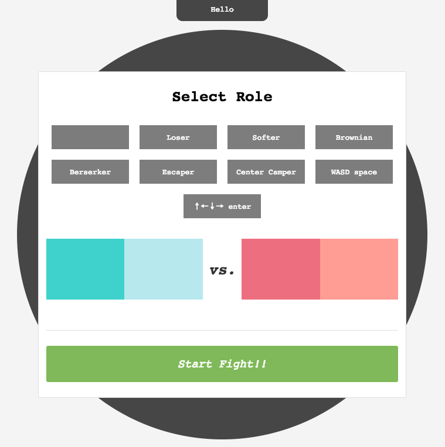

# SNP 期末專題 - Ballfight

  
遊戲有三個元件：
- [競技場](http://ballfight.nctu.me/)：請用電腦瀏覽器打開，為遊戲進行的場所
- hero.py：你可以撰寫你的策略並註冊到競技場中，以下幾種平台的教學
    - [在 windows 上](install/ballfight-windows.md)
    - [在 mac 上](install/ballfight-mac.md)
    - [在 ubuntu 上](install/ballfight-ubuntu.md)
    - [在 c9 上](install/ballfight-c9.md)

有任何問題請用力地把信寄給 `s2821d3721@gmail.com`  


## 勝負條件
- 競技場上有紅方藍方個兩顆球
- 當有一方兩顆球同時超出競技場外的瞬間遊戲結束
- 若遊戲結束那一瞬間，藍方都在界外即算紅方勝利


## 遊戲規則
- 雙方能做的的操作只有對自己的球施予 `[fx, fy]` 的力
- 施力會受到干擾而隨機被轉 ±30deg
- 球的移動會受到與當前速度方向相反的摩差力影響 (`friction = [-v[0], -v[1]]`)
- 施力最大為 `1000`，超過的話會以 `1000` 算
- 初始競技場半徑為 `350`，且會漸漸縮小 (每秒半徑減少 `20`)
- 雙方球的半徑皆為 `25`
- 競技場的圓心為座標系統 `(0, 0)`，右邊為 x 軸正向，下方為 y 軸正向
- 藍方初始位置：左上`(-200, -200)`, 右上`(200, -200)`
- 紅方初始位置：左下`(-200, 200)`, 右下`(200, 200)`
- 中間有一個半徑 `75` 的失控區域。當整顆球都在正中央紅色虛線範圍內時，妳的球將不會再受妳施利的影響，施力將會固定為進入該範圍瞬間的施力，直到離開該範圍。


## 競技場介紹

### 設定連線
  
有兩種模式可以選擇：  
- 離線模式 `Offline mode`：妳只能用鍵盤操控
- 連線模式 `Create Room`：連上伺服器建立一個 Room，之後可以多人連上此 Room 相互對決
    - 網頁（競技場）與妳的 python （hero.py）需透過一個中央伺服器作為資料（競技場資訊，你想要的施力...）傳輸的代理人 (broker)，一個中央伺服器管理很多個不同 Room
    - `broker url`：代理人(broker)的網址，為負責將資料送到正確的地方的中央伺服器
    - `room name`：這個競技場的房間名

> 注意  
> 一個 room 在手機，競技場，hero 進行遊戲時，伺服器的網路負擔約為進出各 5KB/s  
> 建議不要使用手機計費網路進行  


### 選擇角色
  
下方四個紅藍方塊按下後，可以幫其選取角色(策略)。所有可選的角色呈現在上方的黑色方塊中，其中比較特別的是：  
- `` 空白代表什麼都不做
- `WASD space` 用 WASD 鍵控制方向，空白鍵加速
- `↑←↓→ enter` 用上下左右鍵控制方向，enter 鍵加速  

若妳選擇連線模式，在妳的 python 註冊策略後將可在角色欄位中看到並可以選取，但一個 python 只能玩一個角色，若妳想要一次控制兩隻，請執行兩個註冊不同名字的 _hero.py_  


## 用 python script 進行遊戲

打開 _hero.py_
```python
import api


def strategy():

    info = api.get()
    print('=======================')
    print('radius', api.getRadius())
    print('me    ', api.getMe())
    print('friend', api.getFriend())
    print('enemy1', api.getEnemy1())
    print('enemy2', api.getEnemy2())

    return [1000, 1000, 'gogo']


api.play('ws://sunset.nctu.me:8080/ws', 'demo-room', '君の名', strategy)
```
妳可以 `import` 所有妳需要用到的套件，此外一定要 `import api` 以進行連線與註冊妳的策略。  
在函數 `strategy` 裡面實作妳的策略，透過 `api` 取得所有場面資訊然後回傳妳想要的施力大小。此函數當場面_狀態改變_時被呼叫。以下任一條件皆會造成_狀態改變_：  
- 遊戲結束變進行中或反之
- 遊戲進行中，任何場面資訊的更新


### 連線
`api.play('ws://sunset.nctu.me:8080/ws', 'demo-room', '君の名', strategy)`  
- 第一個參數 `ws://sunset.nctu.me:8080/ws` 代表伺服器 url，請換成跟妳想要去的競技場一樣的網址
- 第二個參數 `demo-room`，請換成跟妳想要去的競技場一樣的房間名
- 第三個參數 `君の名` 是妳的名字，請留意別跟其他同房的人撞名
- 第四個參數 `strategy` 為上面實作的遊戲策略的函數名
- __注意__ 此行以下的程式碼將不會被執行，所以請把它擺在 python 程式碼的尾端


### strategy 的回傳值
請回傳一個 `list: [x 方向施力, y 方向施力]`  
若想要與隊友溝通可以把字串放在第三個位置，如：`[1000, 1000, 'fight enemy1 first!!']`  


### 取得場面資訊
用 api 取得場面資訊的方法如下：  
- `api.getRadius()` 回傳一 _float_ 表示當前競技場半徑
- `api.getState()` 回傳一 _string_ 代表遊戲輸贏狀態或仍然在進行中
- `api.getMe()`, `api.getFriend()`, `api.getEnemy1()`, `api.getEnemy2()` 回傳一 _list_ 代表該角色目前的資訊，list 長度為 5 包含該角色的所有資訊： [x, y, vx, vy, '說的話']
- `api.get()` 提供另一種取得資訊的方式，這會回傳一 _dict_ 包含上述所有資訊，結構如下：  
```
{
    'state': 'Hello',
    'me': { 'x': 0, 'y': 0, 'vx': 0, 'vy': 0, 'say': '', },
    'friend': { 'x': 0, 'y': 0, 'vx': 0, 'vy': 0, 'say': '', },
    'enemy1': { 'x': 0, 'y': 0, 'vx': 0, 'vy': 0, 'say': '', },
    'enemy2': { 'x': 0, 'y': 0, 'vx': 0, 'vy': 0, 'say': '', },
    'radius': 0,
}
```
**注意** 我們會把競技場翻轉，讓所有 _hero.py_ 看到的初始狀態為 __總是自己在左上角也就是 (-200, -200)__，而隊友在右上角  
妳與妳的隊友的 `enemy1` 將會是同一個對手，也就是說若妳的 `enemy1` 在妳的正對面，則妳隊友看到的 `enemy1` 會在斜對面。同理 `enemy2`。  


### 執行
在黑盒子(terminal)進入 _hero.py_ 所在資料夾，執行 `python3 hero.py` 即會向該競技場註冊妳的策略。  
