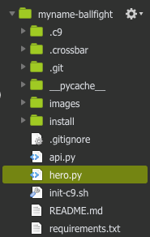
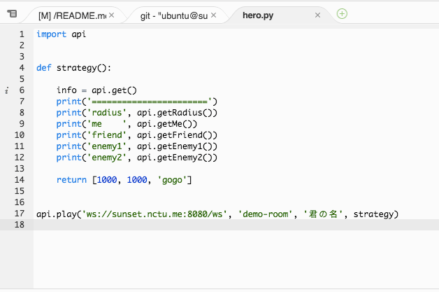
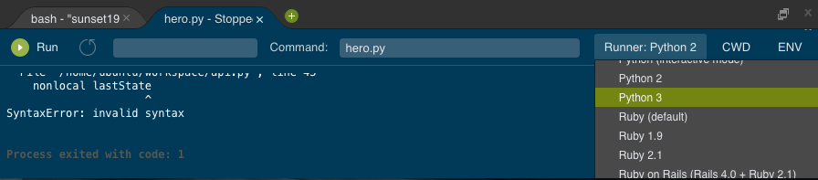
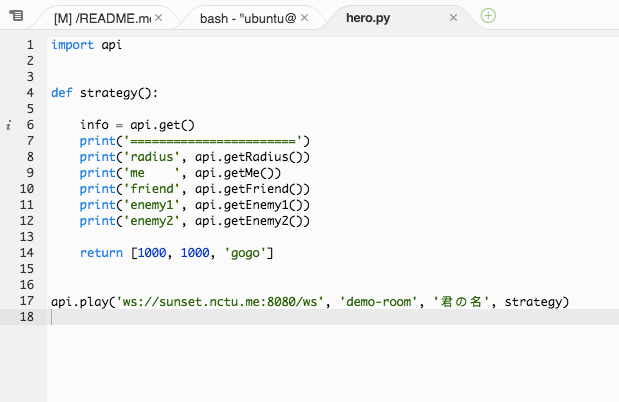
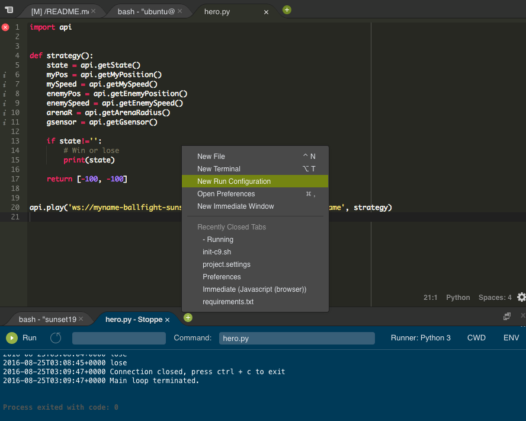
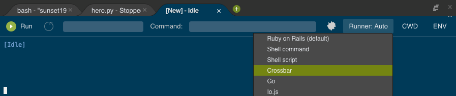

# 在 C9 上設定 hero.py

這篇包含兩部分
- 設定 c9，並執行 _hero.py_ 連上 TA 的伺服器進行遊戲
- 開啟伺服器，並讓 _hero.py_ 與 _競技場_ 連上你自己的伺服器


## 設定 c9
1. 進入 [c9.io](https://c9.io/)
2. 點擊 _Create a new workspace_ (見下圖灰色按鈕)，建立自己的 Workspace  
      
3. 填入必要的基本設定，並按下 _Create workspace_ 按鈕（如下圖）  
    - Workspace name：填上你想取的專案名稱
    - Team：你可以選擇 NCTU 把你的成果分享給班上同學，或選擇不加入任何 team
    - Public：建議你選 Public 而不是 Private
    - Clone from Git：請填上 `https://github.com/sunset1995/ballfight.git`
    - Choose a template：請選擇 Python
      
4. 打開專案，你會看到如下圖的工作環境介面  
      
5. 按 _綠色的 +_ 按鈕然後選擇 _New Terminal_（見下圖），開啟新 Terminal(黑盒子)  
      
6. 在 Terminal 輸入 `sudo ./init-c9.sh`（如下圖）並按下 enter 執行。其中已包含 `sudo pip3 install -r requirements.txt` 把 _hero.py_ 所需套件裝好。  
      


## 編輯與執行 _hero.py_
你可以在左邊的框框找到 _hero.py_，點兩下可以打開該檔案(下圖綠色)。  
  
打開 _hero.py_ 後就可以開始 Coding 了！  
有以下方法可以執行 _hero.py_：  
1. 按下畫面中最上方寫有 _run_ 的綠色按鈕（之後就可以使用鍵盤上的 `F5` 鍵執行（Mac 請按 `fn + F5`））  
2. 開啟 Terminal(黑盒子) 並輸入 `python3 hero.py`  

若你用方法 1 或 2 執行，應該會看到以下 SyntaxError    
  
這是因為預設使用 python2 執行，請按下 Runner 並改選成 Python3 (見下圖)
  
設定完後再次執行就沒問題了。

如果你使用方法 3 執行，與平常 windows cmd 下執行不同的是這邊有 python python3 兩種指令而 window 只有 python。  
留意此處請使用 python3 執行。  

至此已可以成功執行 _hero.py_ 並連上 TA 的伺服器了～
  


## 開啟伺服器
伺服器所需的套件與基本設定已在你執行上面的 `sudo ./init-c9.sh` 時都做好了，此處只需要把伺服器開啟。  
1. 在下方 Panel 中找到 _綠色的 +_ 按鈕按下並選擇 _New Run Configuration_(見下圖)
      
2. 按下 Runner 並選 Crossbar(見下圖)
      
3. __在 Runner 設成 Crossbar__ 的分頁按下該分頁左邊的綠色 Run 按鈕伺服器就會跑起來了
      

跑起來後，顯示資訊第一行 _Ballfight wamp router started at: ws://myname-ballfight-sunset1995.c9users.io:8080/ws_ (如上圖)  
其中 `ws://myname-ballfight-sunset1995.c9users.io:8080/ws` 為你伺服器的 url  
請複製 __你自己的伺服器 url__ 而不是上面範例中的  
改 __hero.py__ 中的連線伺服器  
```
api.play('你自己的伺服器 url', 'yourname', strategy)
```
[競技場](http://snp2016.nctu.me/) 一開始連線設定時請也要記得把 url 改成 __你自己的伺服器 url__  
