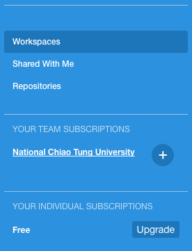
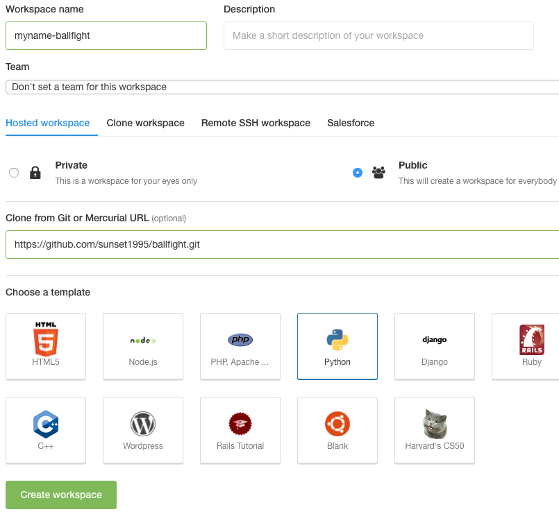
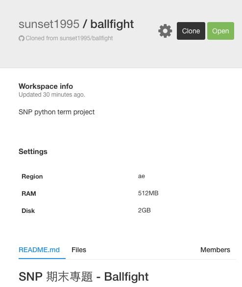
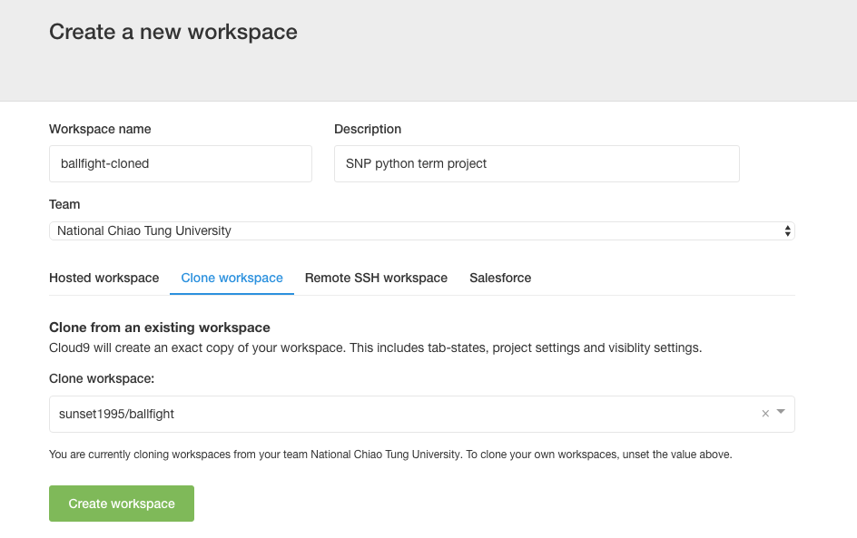
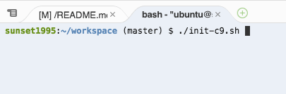
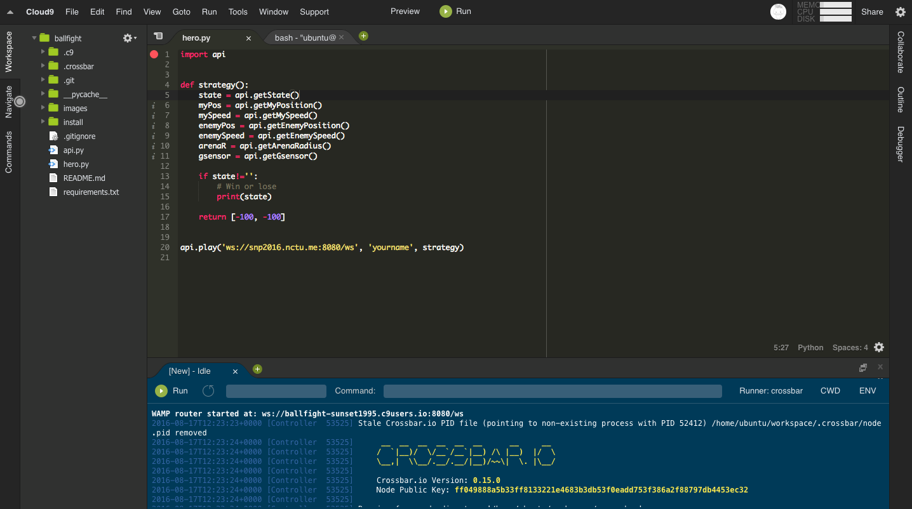
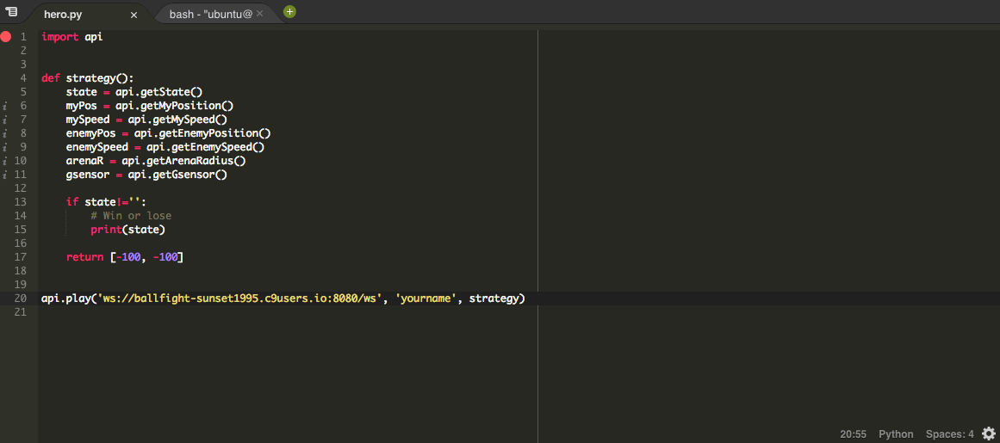
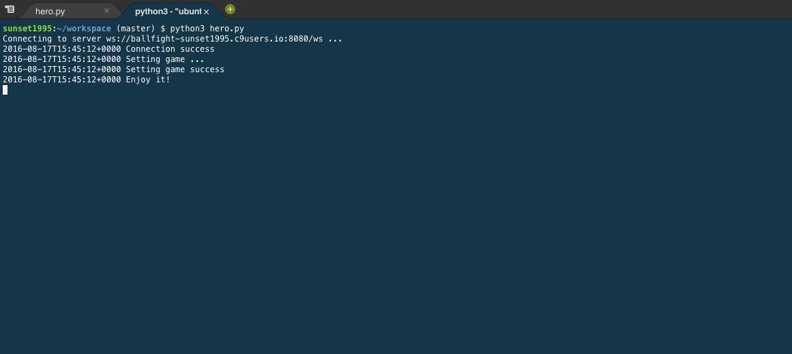

# 在 C9 上設定 hero.py

這篇會教如何在 c9 上架設自己的 ballfight 伺服器，並直接在 c9 上編輯 _hero.py_  


### Clone
1. 點擊 _National Chiao Tung University_ 進入 Team  
      
2. 點擊 sunset1995 下方的 _nctu/ballfight_ (圖右下)  
      
3. 點擊右邊的深灰色按鈕 _Clone_  
      
4. 點擊左下方綠色按鈕 _Create workspace_  
      
5. 完成，以後可以點擊 _Open_ 進入編輯  
      


### 畫面介紹
詳細的介紹可以參考[官網](https://docs.c9.io/docs/)  
玩 ballfight 只會需要用到中間最大的兩塊 panel  
  


### 開啟伺服器
點擊下方 panel 中的 _Run_ 按鈕即可開啟伺服器  
  
顯示資訊的第一行
```
WAMP router started at: ws://ballfight-sunset1995.c9users.io:8080/ws
```
其中的 `ws://ballfight-sunset1995.c9users.io:8080/ws` 為你伺服器的 url  
請複製該 url，在_競技場_跟 _hero.py_ 裡的伺服器 url 都要填此  
你也可以把該 url 貼給用其他方式安裝 hero 的人，邀請他使用你的伺服器  
> c9 一段時間不用後會自動關掉你的伺服器


### 編輯並執行 hero.py
你已在上方的 panel 點擊 _hero.py_ 分頁開始編輯  
  
請記得把
```
api.play('ws://ballfight-sunset1995.c9users.io:8080/ws', 'yourname', strategy)
```
中的 url 改成你自己伺服器的 url  
[競技場](http://snp2016.nctu.me/)與[手機重力感應器](http://snp2016.nctu.me/gsensor.html)中的 url 也記得要改成你自己的伺服器 url


點擊 panel 的 _bash_ 分頁，輸入
```
python3 hero.py
```
就會執行 _hero.py_ 了
  
**注意**：若你更新了 _hero.py_，需要在 terminal 中 `ctrl+C` 結束原本連線中的 _hero.py_ 並重新執行 `python3 hero.py`
