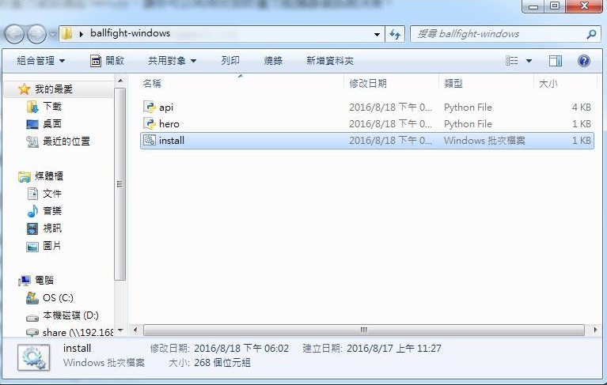
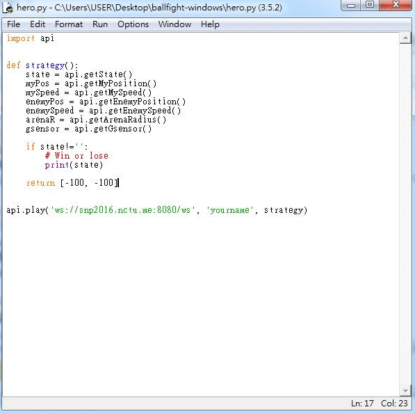

# 在 Windows 上設定 hero.py

### 下載與安裝
下載 [hero.py for windows](http://ballfight.nctu.me/ballfight-windows.zip) 並解壓縮  
打開該資料夾，找到 _install_ 點兩下，執行完後就會把 dependency 裝好  
  
完成！可開始實作 hero 的策略並進行遊戲！

### 執行 hero.py
可用 Idle 編輯 _hero.py_  
  

按 `F5` 即可執行  
  

**注意**：若你更新了 _hero.py_，需要在 terminal 中 `ctrl+C` 結束原本連線中的 _hero.py_ 並重新執行 `python3 hero.py`
